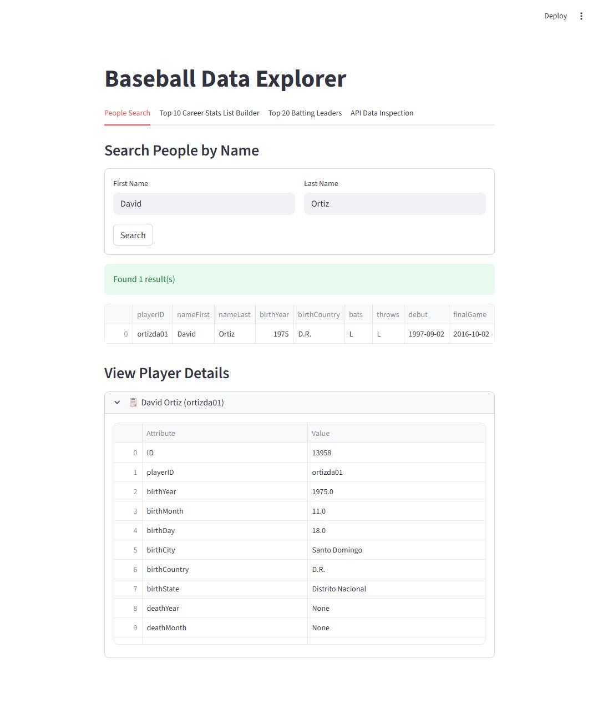
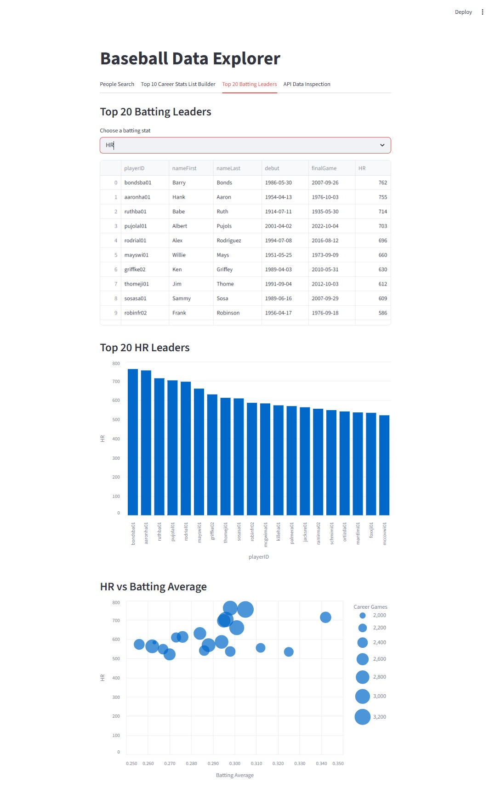

# Baseball Data Explorer

Streamlit frontend for exploring baseball analytics datasets exposed by the Baseball Data API.

This project focuses on fast interactive analysis: player search, career batting leaderboards, API response inspection, and visual comparisons such as leaderboard bar charts and batting-average bubble charts.

## Features

- Search people records by first and last name.
- Build top-10 career batting summaries from year-by-year batting data.
- Explore top-20 batting leaders for `H`, `2B`, `3B`, `HR`, `SB`, and `RBI`.
- Compare leaderboard results visually with bar charts and bubble charts sized by career games.
- Inspect raw API responses and table previews directly in the UI.

## Tech Stack

- Streamlit
- pandas
- Altair
- requests

## Related Project

This UI consumes the Baseball Data API:

- https://github.com/highfive52/baseball-data-api

## Screenshots

### People Search



### Top 20 Batting Leaders



## Local Setup

Install dependencies:

```powershell
pip install -r requirements.txt
```

Configure the API base URL.

PowerShell example:

```powershell
$env:BASE_URL = "http://localhost:8000"
$env:VERIFY_SSL = "true"
```

If you are working against a local development endpoint with a self-signed certificate, you can disable certificate verification for that session:

```powershell
$env:VERIFY_SSL = "false"
```

Run the app:

```powershell
streamlit run app.py
```

## Streamlit Secrets

You can also configure the app with Streamlit secrets instead of environment variables.

Example `.streamlit/secrets.toml`:

```toml
BASE_URL = "http://localhost:8000"
VERIFY_SSL = true
```

## Project Structure

- `app.py` contains the Streamlit UI.
- `skills/` contains AI-oriented guidance and API usage notes used during development.
- `.github/workflows/` contains lint automation.

## Development

Install and enable pre-commit hooks:

```powershell
pip install pre-commit
pre-commit install
pre-commit run --all-files
```
